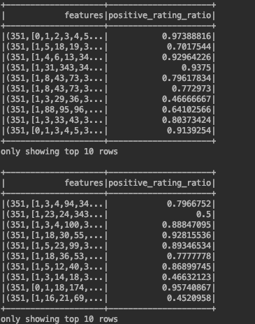
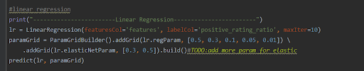

Prediction of praise rate for new games
========================================
Mengxuan Qiu:40082721 
Xiyun Zhang:40059295 
 Yilin Li: 40083064 
Yuhua Jiang:40083453 
# Abstract
In recent years, for people of all ages and all places, PC games have become an irreplaceable part of their daily lives. Among the most famous digital gaming distribution platforms, Steam not only attracts tons of loyal customers but also has a highly admirable praise rate of their games. For the records, it may depend on several independent factors such as language support and game classification. In order to explore the reason behind the   success of the steam platform, in this project, our team intends to find out what are those underlying factors and use them to predict the praise rate of the corresponding game. We implement several different supervised learning algorithms from spark.ml library on an open data source provided by Steam. When the training is finished, The model should be able to predict the praise rate of new games.

# 1.Introduction
As is well known, the Steam platform is one of the biggest digital distribution platforms for PC games. By 2017, users purchased games through the Steam store for a total of approximately US $ 4.3 billion, accounting for at least 18% of PC game sales worldwide [1]. By 2019, the Steam service has more than 34,000 games and more than 95 million monthly active users [1]. In this context, it is worth studying the underlying factors behind the popularity and use them to find out the praise rate a new may chase.
In this project, several supervised learning regression algorithms will be used to build a model to predict the praise rate of the new games. Then we will analyze the performance of different regression algorithms based on this dataset according to the prediction results and evaluator.
More specifically, the proportion of positive comments in the total number of comments will be used as a standard for the positive rate of a game. Apart from that, the following factors will also be considered: release date, English, developer, publisher, platforms, required age, categories, genres, Steamspy tags, achievements, average playtime, median playtime, owners, price. By using one-hot encoding and self knowledge to prepare and filt the non-necessary factors,the model will build only based on a partial of original dataset .
For the smooth progress of this project, we will carry out the following related work. Firstly, we will check the relevant papers and online materials to confirm the reliability of the research direction, find the relevant data sets and analyze which data in the data sets can be used in the project. After that, we are going to look at the previous work that has been done with the dataset we select, finding the useful technologies and approach we can apply in our project, learning from their experience and defining the improvements we can make. Secondly, apply data processing technologies to process the raw data into a data format that can be used directly by supervised learning. Thirdly, select the applicable data analysis and regression algorithms to build the model. After training and testing the model, it can be used to predict the praise rate of a game. In the end, discuss and analyze the performance of each algorithm. All the above work requires the fair division and cooperation of all the team members. In order to reach that, we plan to discuss the project progress and solve the difficulties encountered on a weekly basis.

# 2.Materials and Method
## 2.1 Dataset
### 2.1.1 Data Source
The dataset we will use in this project is retrieved from https://www.kaggle.com[2], which is composed of more than 27,000 games’ information gathered from the Steam store and SteamSpy APIs around May 2019. 
A supportive data ‘steamspy_tags’ is also retrieved from the same website. This file includes all possible steamspy_tags values among all games from the above dataset.
2.1.2 Data Transformation and feature selection
The following is a snapshot of original data schema

Appid and name is removed from features since they have minimum value for training model
Release_date is transformed to the number of days the game had been released until the dataset was collected(May 2019). Since the exact date when dataset was collected is unknown, we assumed it is on May 15th.
Value for english column is either 1 or 0, standing for english supported or not. 
Developer has more than 70,000 distinct values, if we apply one-hot encoding and map each of the value to an additional feature the feature space will end up having very high dimension. The solution is to transform this feature to the number of products for each developer, representing the scale of the game company
Publisher is removed from the feature since it is overlapping developer
Platforms is applied one-hot encoding(details for this technology are explained later in this report) and mapped to three additional features(mac, windows and linux)
Categories and genres overlap steamspy_tags, they are removed from features
Steamspy_tags is applied customized one-hot encoding. Each game can have multiple tags, in built one-hot encoding library in spark does not support a categorical feature to have multiple values where our customized one does so.
Positive_ratings and Negative_ratings are used to generate positive_rating_ratio, which is our label.
The following is a snapshot of schema of selected features after transformation

(300+ features generated from steamspy_tags using one-hot encoding are omitted here)

## 2.2 Technologies for Data Processing
Because our raw data is very clean and there is no missing or erroneous data, for preprocessing we mainly just modified the form of our label and applied one-hot encoding to some features in string format. 
To avoid adding too many features, we’ve also deleted some useless columns which have less affection on final results, such as developer information, name of games.

### 2.2.1 One-hot Encoding
Since some informational features selected for this project are categorical and discrete, it is not a good idea to simply give an integer to represent each one of the categorical features, and feed them directly to the training phase. Because without any pre-processing, the output model will ‘think’ that the higher/lower the categorical value is, the better/worse the category is. However, in fact, every category should be treated equally.

eg. ‘steamspy_tags’
The form of the string consists of some certain tags with semicolons. The amount of tags actually is only about 300. So that we download the other CSV file which contains the name of the tags. And then generate the tags columns in the final dataframe. For those extracted features, we add ‘1’ or ‘0’.

One-hot encoding is the solution to this problem, by representing each feature with binary vectors. In such a case, the model will not have a preference for a specific data point because it has a better value representing its category.

However, according to the format of our raw datas which needs to be encoded, we decided to encode it manually rather than recall the methods in pyspark.

### 2.2.2 K-fold cross-validation
To assure the accuracy of our model and prevent under/overfitting, the evaluation of the performance of the model is required. To achieve that, we chose k folder cross-validation to re-sampling our dataset. The exact value for k will be decided during the implementation of this project.

## 2.3 Algorithms
After basic analysis, brainstorming and background research on the scope of our project and the characteristics of the dataset, we decided to apply the following techniques or algorithms from spark.ml library in our project, to get an accurate and efficient model.

### 2.3.1 Linear Regression
Linear regression is a common Statistical Data Analysis technique. Linear regression analysis is used to predict the value of the praise rate of a game based on the values of other factors when the praise rate as the dependent variable and the factors are independent variables.
There are two types of linear regression, simple linear regression and multiple linear regression. We observed that there are more than 5 features that are directly proportional to the results(rate of our good feedback). Therefore, we plan to try the multiple linear regression models first to do the prediction.

### 2.3.2 Decision Tree Regression
Using Decision Tree can build a regression model in the form of a tree structure. It breaks down a dataset into smaller subsets while at the same time an associated decision tree is incrementally developed. The spark.ml implementation supports decision trees for binary and multiclass classification and for regression, using both continuous and categorical features. The implementation partitions data by rows, allowing distributed training with millions or even billions of instances.

### 2.3.3 Gradient-boosted Tree Regression
Gradient-boosted trees (GBTs) are a popular regression method using ensembles of decision trees. GBTs iteratively train decision trees in order to minimize a loss function. The spark.ml implementation supports GBTs for binary classification and for regression, using both continuous and categorical features.

### 2.3.4 Random Forest Regression
Random forests are ensembles of decision trees. Random forests combine many decision trees in order to reduce the risk of overfitting. The spark.ml implementation supports random forests for binary and multiclass classification and for regression, using both continuous and categorical features.

# 3.Results
## 3.1 Dataset Analysis and Preprocess
The data after preprocess: After filtering some useless features and one-hot encoding, we have 351 features in all.
We used Pipeline to generate a vector which contained all the features that are not empty and calculated the ‘positive_rating_ratio’ through positive rating numbers and negative rating numbers.

Besides, we chose k folder cross-validation to re-sampling our dataset. The k value was set as 5 according to the size of our dataset and hardware conditions of our laptops. We split our dataset to 1:9 (testing, training) and only the training part will be applied k-fold validation. The main evaluation metric is RMSE.

## 3.2 Technology Implementation
One hot encoder was implemented based on UDF in pyspark.

Assign different parameters through paramGrid. ParamGrid is used as parameter candidates pool. We predefined a set of parameter candidates based on our knowledge and research. At the end of the cross-validation, the param has the smallest RMSE will be chosen.

Linear Regression parameters: regParam, elasticNetParam.

Decision Tree Regression parameters: maxDepth, minInstancesPerNode.

Gradient-boosted Tree Regression parameters: maxDepth, maxIter.

Random Forest Regression parameters: maxDepth, numTrees.
-maxDepth: The maximum depth of each tree in the forest. Increasing the depth can improve the expressive ability of the model, but too many results in overfitting. 
-numTrees: The number of trees in the forest. Increasing the number can reduce the variance of prediction and improve the accuracy of model testing.

## 3.3  Algorithms Comparison
Linear regression is easy to understand, the calculation is not complicated, and the running time is short. But it doesn't fit the nonlinear data well.

Decision trees are simple to calculate, can deal with unrelated features, and can make feasible results for large data sources in a relatively short time. But the decision tree may produce overfitting, and sometimes it is unstable, because small changes in the data may generate completely different decision trees. The decision tree is a greedy algorithm and cannot guarantee to return a globally optimal decision tree.

Both GBTs and Random Forest are ensembles of decision trees. GBTs train only one tree at a time, and Random Forest can train multiple trees in parallel. So GBTs training time is longer than Random Forest. Random forest has the best performance in this project. It can avoid overfitting by training more trees. The effect of Random Forest will increase monotonously as the number of trees increases. But too many trees in GBTs will increase the possibility of overfitting. (Random Forest reduces variance by multiple trees, and GBTs reduce bias by multiple trees).

### 3.3.1 The Reason We Choose Root-Mean-Square Error
 
There are three metrics we considered to evaluate the model at the beginning, MAE(mean absolute error), R^2(R square),RMSE(root mean square error).

The MAE usually are sensitive to some very big errors. In our data, there are not too many outliers.So that it is not necessary to use it for our model.

The coefficient of determination, or R² (sometimes read as R-two), is another metric usually used to evaluate a model and it is closely related to MSE, but has the advantage of being scale-free — it doesn’t matter if the output values are very large or very small,the R² is always going to be between -∞ and 1.
When R² is negative it means that the model is worse than predicting the mean. However, each game in our dataset is independent, the mean value doesn’t have any meaning. It is also unnecessary to compare the prediction score with the mean score.

Therefore, we only choose Root Mean Square Error as our metric.
 

### 3.3.2 Analysis

For each round of different K values, Random Forest has the lowest RMSE.
Generally, for tree models, the RMSE are basically decreased with the increase of K fold. However, Linear Regression is not sensitive to the change of K value and has the worst performance among the 4 models we trained. The main reason for this result should be the constitution of our features. Some of them(the tags that are encoded) are not linearly related to the result.
Therefore, Random Forest  regression is the best model for our dataset.

# 4.Discussion
## 4.1 Relevance
Regression analysis is a predictive modeling technique used to study the relationship between the target as dependent variable  and the predictor variable as  independent variable. This project belongs to the topic of regression prediction in supervised learning, which uses different regression algorithms to build models for prediction of praise rate. To be specific, GBTs are based on Decision Tree and Boosting mechanism, while random forest is based on Decision Tree and Bagging mechanism, both of them are ensembles of Decision Tree. On this basis, the overall performance of GBTs and Random Forests is better than Decision Tree.
## 4.2 Limitations
The most obvious limitation of our prediction is the number of features. We need more numerical features which can represent the popularity of a game. For instance, the financial investment on producing the game should be an important feature for a game.
Secondly, we should try some other models like KNN, SVM to compare. Because decision tree models usually take higher training time than other models. A small change in the data can cause a large change in the structure of the decision tree causing instability.
## 4.3 Future Work 
For the future research and improvement work, our team intends to put more effort on discovering the related features and using a more logistical approach to convert them into the numerical system. In order to get a related optimite result, we may need more data preparation knowledge.
Apart from that, it is necessary to keep trying to implement different algorithms on the dataset and analyse the result with multiple metrics.
      
       
# Reference
[1] Steam (service), last edited on 8 February 2020, https://en.wikipedia.org/wiki/Steam_(service)
[2] Steam Store Games (Clean dataset). (2020). Retrieved 11 February 2020, from https://www.kaggle.com/nikdavis/steam-store-games

